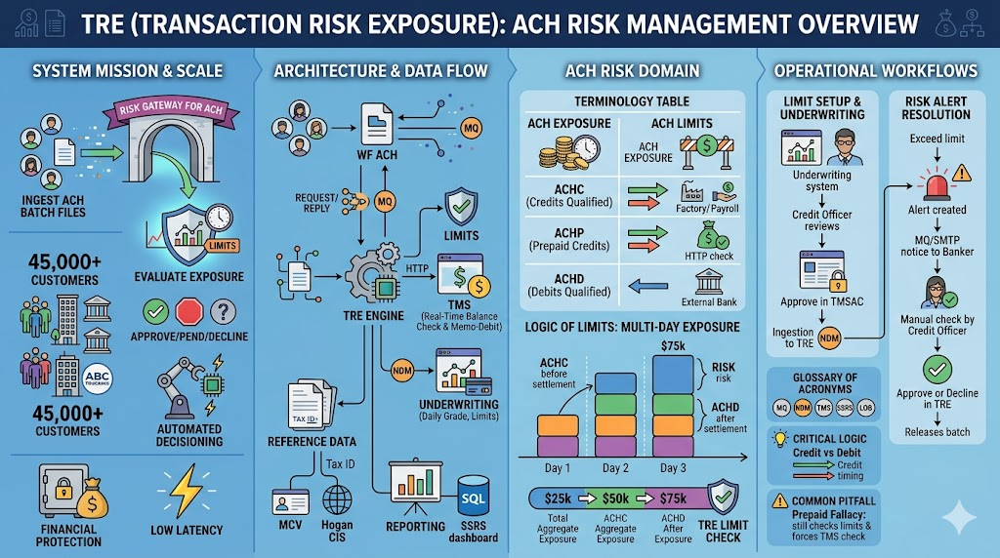

# TRE (Transaction Risk Exposure) Documentation Wiki



> The TRE (Transaction Risk Exposure) team acts as the automated "safety net" for the bank's electronic money transfers, **specifically serving wholesale customers**.
> 
> Before a business can send out massive batches of payments (like payroll) or pull money from customers, the TRE system instantly checks if that business has enough actual cash or approved credit to cover the total amount. **Note: TRE does not execute financial settlements or deal with direct money movement; it solely evaluates risk to prevent financial loss.** Essentially, they function as a high-speed financial bouncer—stopping risky transactions in their tracks to ensure the bank doesn't accidentally lose millions of dollars.

---

## 1. System Mission & Business Context

**The Core Mission**
The TRE (Transaction Risk Exposure) application is the critical risk gateway for wholesale transaction processing. Its primary mandate is to evaluate, approve, or suspend batch files based on real-time and multi-day exposure limits before they are released to the Federal Reserve. TRE assesses two primary types of transactions: **ACH** and **ICING** (checks).

**Business Impact & Scale**
* **Customer Base:** Manages risk exposure for approximately **45,000 wholesale customers**.
* **Financial Protection:** Prevents massive financial loss by ensuring customers do not transmit funds exceeding their approved credit thresholds or current account balances.
* **Automation Necessity:**
    * Processing at this scale requires highly automated, low-latency decisioning.
    * While standard transactions are evaluated via matrix logic and MQ queues instantaneously, exceptions trigger automated "Risk Alerts" for manual intervention by Responsible Credit Officers and ACH Operations.

---

## 2. Architecture Analysis Template

### A. Core Data Flow & Routing
The foundational decision pipeline operates as follows:
`ACH` ➔ `ACH_MESSAGE_LOG` ➔ `TRE MATRIX` ➔ `RISK ALERT` (if flagged) ➔ `BANKER APPROVE/DECLINE` ➔ `ACH_MESSAGE_LOG` ➔ `ACH`

1. **Ingestion & Logging:** Customers submit Direct Deposit/Payment files to **WF ACH**. WF ACH sends an XML message request via MQ (`NA.TRE.BATCH.REQUEST`) to TRE. All raw messages from the MQ batch are inserted into the `ach_message_log` table (or `icing_message_log` for checks).
    * *XML Payload details:* Contains `<Header>`, `transactionId` (used for activity and risk alert tracking), `fileId`, `accountNumber`, `accountType` (e.g., DDA), `onUsInd`, `prepaidInd`, and `tranCode` (EVAL, EVALS [same day], EVALL [late day], REEVAL, APPR).
    * *RiskItem Tags:* The XML includes specific item data such as `secCode` (e.g., PPD), credit/debit amounts, current limits, and existing exposures. Every element except the Header tag undergoes strict validation.
2. **Evaluation:** TRE queries limits, current multi-day exposure, and customer Credit Risk Ratings.
    * *Ratings Fallback Logic:* Credit risk ratings (BQR, CQR, AQR, PD) are loaded in an order of priority from multiple sources. If the latest info is unavailable, the previous information carries forward as a fallback.
    * *If Prepaid (`prepaidInd: Y`):* TRE makes an HTTP call to **TMS** (which fetches balance info from **RCS**) to check balances. **ILMS** handles the memo posting and maintains the real-time balance of the bank.
3. **Decision:**
    * **Approve:** TRE replies via MQ (`NA.TRE.BATCH.REPLY`) with a `tranCode` of `APPR` and logs the exposure. The file moves to the **ACH Warehouse** for Federal Reserve routing.
    * **Pend/Decline:** TRE returns a `PEND`, `DECL`, or `HOLD` status, creates a Risk Alert (status: A, PA, CA, AO, HD), and triggers event messages via MQ (`TRE.SMU.NOTIFYS`). If the `SENT_EXT_EMAIL` flag is triggered, an external email is sent via SMTP to the customer/banker/credit officers.

### B. Component Breakdown
* **TRE Engine:** The core decisioning matrix that calculates limits vs. requested batch totals.
* **TRE Matrix:** The rules engine applied when a transaction goes over a standard limit.
* **TMS (Treasury Management System):** Interfaces with TRE for real-time balance checks and memo-debiting (specifically for Prepaid customers).
* **ILMS:** Responsible for maintaining the real-time balance of the bank and handling memo posting.

### C. Integrations & Data Sources
* **Accounts & Facilities:** Account data is loaded directly from the `accounts` table (Hogan). Facilities are created in TMSAC and stored in the `facility` table (holds latest risk ratings).
* **Underwriting/Credit:** Receives daily NDM files from **AFS** (Customer Grade) and underwriting systems (**CATools, Credit View, Athena Blast**). AQR ratings are updated once a day via TMA API calls.
* **Reference Data:** Integrated with **Hogan CIS** (Legal Name, Tax ID) and **MCV** (Tax ID grouping, AU/LG groupings).
* **RBAC:** Roles and permissions are managed via the `portfolio_manager` table, which syncs automatically upon Ping SSO login (capturing `ADENT_ID`, `HR_ID`, `ADENT_GROUPS`).
* **Reporting:** Data flows into **Oracle PNL2**, then to **SQLServer** for **SSRS** (SQL Server Reporting Services) reporting.

---

## 3. ACH Risk Domain Guide

ACH is not a real-time money movement network; it relies on **settlement dates** and **multi-day processing windows**.

### Terminology Table

| **Term** | **Definition** |
| :--- | :--- |
| **ACH Exposure** | The total dollar amount of unsettled, in-flight ACH transactions a customer has pending at any given moment. |
| **ACH Limits** | The maximum allowable exposure for a specific transaction type. Limits are segregated by type (ACHC, ACHP, ACHD). |
| **ACHC (Credit Qualified)** | Transactions where the customer is *sending* money (e.g., Payroll). Risk: The bank sends the money to the Fed, but the customer's account doesn't have the funds to cover it on settlement day. |
| **ACHP (Prepaid Credit)** | Like ACHC, but the customer must have cash in their account *right now*. TRE checks balance via TMS and memo-debits the account immediately via ILMS. UI shows `ACHP` in Prod column. |
| **ACHD (Debit Qualified)** | Transactions where the customer is *pulling* money from external accounts. Risk: The pulled funds are returned (e.g., insufficient funds at the external bank) *after* the customer has already spent the credited money. Evaluated if `debit_amt > credit_amt` and `prepaidInd: N`. |
| **Settlement Date** | The future date when funds actually move between the banks at the Federal Reserve. |

### The Logic of Limits: Multi-Day Exposure Calculation

Exposure **stacks across days**. Limits are not evaluated on a per-file basis, but on a rolling timeline. In the database (`activity` table), exposure is logged decrementally over the settlement period (e.g., 100% on Day 1, 50% on Day 2, 0% on Day 3).

**Example Calculation:** If a customer submits three $25,000 files with overlapping settlement windows, their exposure aggregates on the overlapping days.

| | **Day 1** | **Day 2** | **Day 3** | **Day 4** | **Day 5** |
| :--- | :--- | :--- | :--- | :--- | :--- |
| **File #1** | $25,000 | $25,000 | $25,000 | | |
| **File #2** | | $25,000 | $25,000 | $25,000 | |
| **File #3** | | | $25,000 | $25,000 | $25,000 |
| **Total Exposure** | **$25,000** | **$50,000** | **$75,000** | **$50,000** | **$25,000** |

**TRE ensures that the *Total Exposure* on any given day never exceeds the customer's global ACH limit.**

---

## 4. Operational Workflows & Alert Mechanics

### Limit Setup & Matrix Administration
Limits and matrix thresholds are enforced by TRE based on Line of Business (LOB) assignments (e.g., Orbit LOB). 

1. **Review:** Credit Officers use LOB-specific tools (CATools, Credit View, Athena Blast) to underwrite the customer.
2. **Approval:** Limits are approved in **TMSAC** by Credit Officers.
3. **Ingestion:** Approved limits are currently entered manually into TRE by the TRE Support Team.

Administrators define risk parameters in the **Matrix Administration Screen** using:
1. **BDG Ranges:** (BDG >= Range Start to BDG <= Range End).
2. **Max % of Limit.**
3. **Max $ Exp Over Limit.**

### Risk Alert Resolution
When a file violates the LOB matrix rules (e.g., over limit, insufficient funds for ACHP), it enters a **PEND** status and generates a row in the `risk_alert` table (or `icing_risk_alert` for checks).

1. **Alert Creation:** The `risk_alert` entry logs critical decision info including `APPL_SEQ_NO`, `MARKET_SEGMENT` (matrix info), `OVER_AMOUNT`, `BAL_EXP_CUST` (balance exposure), `SEC` code, and `TMS_RETRY_STATUS` (for prepaid).
2. **Notification:** Bankers receive an MQ/SMTP notification (`TRE.EMAIL.REQUEST`), tracked by the `SENT_EXT_EMAIL` flag.
3. **Review & Auto-Reevaluation:** Credit Officers review the alert within the TRE Detailed Page. 
    * *Note:* Opening the Risk Alert Details page may automatically force a reevaluation batch job (e.g., pinging TMS for a fresh balance check on prepaid items). This action can automatically flip the status to Approved without manual intervention if conditions are met.
4. **Action:** If manually approved (`DECISION_DATETIME` is logged), ACH Operations formally Approves/Declines the file in TRE, sending the MQ reply back to ACH. For `REEVAL` transactions, the system updates the existing record rather than inserting a new one.

---

## 5. Developer Testing & Verification Guide

### Testing in lower environments (MQ Tester)
* **URL:** `tredev2.wellsfargo.com/mqtester/controller/home` (Requires active login session prior to accessing; without an active session, the page will error or messages will hang in the queue).
* **Payload Formatting:** XML payloads must be pasted as a **single continuous line**. Multi-line pastes will be treated as separate messages and fail validation.
* **Routing queues:**
    * **ACH:** Push to *Batch request queue* or *Online request queue* (Both process the same way).
    * **ICING:** Push to *ICING Request queue* (or *ICING Reply Approval* for status updates).

### Database Tracing & Verification
* **Server Timezone:** Note that most TRE servers operate in **EST**.
* **Log Check (In/Out Messages):** `SELECT * FROM ach_message_log WHERE message LIKE '%<acc No>%' AND message_ts > tresysdate -1;`
* **Approved Transactions (APPR):** If the `tranCode` in the XML was `APPR`, do **not** check the `risk_alert` table. Go directly to `activity`. 
   ```sql
   -- appl_seq_no is typically a concatenation of transactionId + settlementDate
   SELECT * FROM activity WHERE appl_seq_no LIKE '...';
   ```

* **Detailed Activity:** Query `activity_transaction_details` (this table only contains 1 row per transaction, unlike the `activity` table which generates multiple rows based on settlement days).  
   *Note: For multi-day exposure, the `activity` table will insert multiple rows (e.g., 3 rows for a 3-day settlement, even if ACHD settles later). To see the singular, granular record of the transaction, query `activity_transaction_details`.*

3. **Verify Pending/Declined Transactions:**
   Query the `risk_alert` table using the `transactionId`. If `APPL_REQ_STATUS` = `PA` (Pending Approval), it requires UI intervention.

### `EVAL` vs `REEVAL` Transaction Codes
* **`EVAL`:** Standard evaluation. Inserts new rows into `activity` and `activity_transaction_details`. 
* **`REEVAL`:** Forces the system to re-process an *existing* transaction. It does **not** update the `transactionId` or insert new rows into the activity tables; it simply updates the existing record. Validate `REEVAL` execution via system logs rather than looking for new DB inserts.

---

## 6. Data Dictionary & Acronyms

### Key Database Tables
| **Table Name** | **Primary Purpose** |
| :--- | :--- |
| `ach_message_log` | Stores raw XML messages coming in from MQ. |
| `activity` | Stores core transaction records. Will have multiple rows based on settlement days (e.g., 3 rows for ACHD even if settlement is later). |
| `activity_transaction_details` | Stores deep details of a transaction (1 row per transaction). |
| `risk_alert` | Logs pending or held transactions needing review. |
| `icing_message_log` | Stores raw XML messages for check processing. |
| `icing_risk_alert` | Logs pending or held check transactions. |
| `portfolio_manager` | Handles RBAC (Role Based Access Control). Columns include `HR_ID`, `ADENT_GROUPS` (roles). Auto-updates upon Ping login. |
| `facility` | Maintains the latest available risk ratings (sourced from TMSAC). |
| `accounts` / `approval_authority` | Stores core account data and authority thresholds. |

---

### Glossary of Technical Acronyms

* **AQR / BQR / CQR:** Types of Credit Risk Ratings. BQR (Borrower Downgrade Rating) is synonymous with **BDG**.
* **AU / LG:** Accounting Units / Line Groups.
* **ICING:** Internal term for check processing transactions.
* **ILMS:** System that maintains the real-time balance of the bank and handles memo posting.
* **MQ (Message Queue):** IBM MQ used for asynchronous, reliable communication between TRE and ACH.
* **NDM (Network Data Mover):** A file transfer protocol used to ingest daily batch files.
* **PD:** Probability of Default (a Credit Risk Rating).
* **RCS:** System that TMS fetches balance information from.
* **SSRS:** SQL Server Reporting Services. The BI tool used to visualize exposure and risk history.
* **TMS (Treasury Management System):** Used for real-time account interactions.

### Critical Domain Notes

> 💡 **Critical Logic: Credit vs. Debit Exposure Logging**
> Notice the difference in *when* exposure is logged based on transaction type:
> * **Credits (ACHC):** Exposure is logged *prior to and up to* the settlement date (e.g., Sent 5/29, Settled 6/3. Exposure = 5/30, 5/31, 6/3). This is because the risk ends once the settlement is successfully funded.
> * **Debits (ACHD):** Exposure is logged *on and after* the settlement date (e.g., Sent 5/29, Settled 6/3. Exposure = 6/3, 6/4, 6/5). This accounts for the **Return Window**—the days after settlement where the external bank might reject and return the debit.

> ⚠️ **Common Pitfall: The Prepaid Fallacy**
> Do not assume Prepaid (ACHP) files bypass exposure limits just because they are funded upfront. TRE still tracks their exposure limit AND actively forces a balance check via TMS. If the TMS check fails (Insufficient Funds), an immediate Event Message is dispatched to the customer.


----
---
name: ui-tests
description: Generates UI test cases based on recent Git commits for tre-tre and tre-nlcr
agent: agent
---

You are an expert QA automation engineer. Your goal is to generate UI test cases for a release based on recent code changes. 

Follow these steps exactly in order:

1. **Fetch Commits:** Run the terminal command `git log --oneline -n 10` and display the formatted list to the user so they can select the commit hashes they want to include in the release. **Stop and wait** for the user to reply with their selected commits.
2. **Run Diff:** Once the user provides the commit hashes, run the following terminal command to get the consolidated diff, explicitly filtering out JUnits and configuration files:
   `git diff <commit-hash-1> <commit-hash-2> -- . ':(exclude)*src/test/java/*' ':(exclude)*.xml'`
3. **Analyze:** Read the output of the diff in memory. Focus strictly on UI, routing, and business logic changes within the `tre-tre` and `tre-nlcr` components.
4. **Generate Tests:** Create a comprehensive list of UI test cases. Specify exactly which screens to navigate to and what user actions to validate based on the diff.
5. **Write to File:** Create a new file (or overwrite if it exists) named `Release-Tests.md` with your generated markdown output. Do not just print the markdown in the chat; use your tools to write it directly to the file system.
